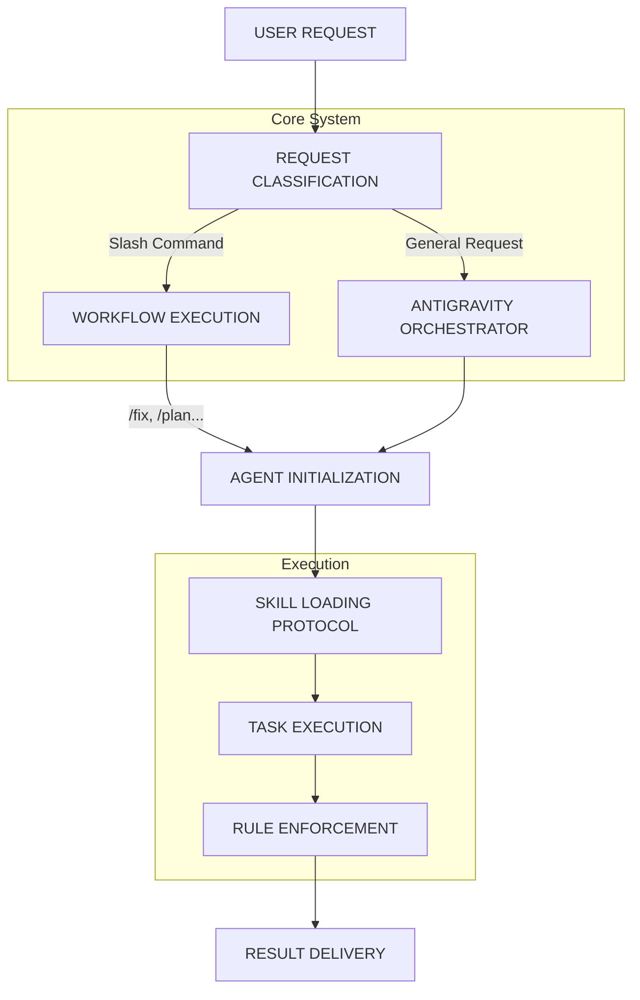

# AG Core

> **The Core of Antigravity** - A lightweight, extensible AI Agent framework.
>
> _Forked from [vudovn/antigravity-kit](https://github.com/vudovn/antigravity-kit) by [htrnguyen](https://github.com/htrnguyen)_

AG Core (Advanced Generator Core) provides the essential kernel for building your own AI agent system. This package focuses on the fundamental **Orchestrator** and core workflows, giving you a clean slate to build upon.

## Quick Install

```bash
npx @htrnguyen/ag-core
```

This command interactively guides you through the setup, installing the `.agent` folder into your project.

### Other Commands

```bash
# Update existing .agent folder
npx @htrnguyen/ag-core update

# Remove .agent folder
npx @htrnguyen/ag-core remove
```

### Important: IDE Configuration

If you use **Cursor** or **Windsurf**:

1. **Do NOT** add `.agent/` to your `.gitignore`.
2. Instead, add `.agent/` to `.git/info/exclude`.
3. This ensures the AI can index the context while keeping your repo clean.

## What's Included

| Component                    | Description                                                                 |
| :--------------------------- | :-------------------------------------------------------------------------- |
| **Antigravity Orchestrator** | The central "Senior Architect" persona that governs code generation.        |
| **Basic Skills**             | Essential capabilities like `basic_code_modification` with safety checks.   |
| **Core Workflows**           | `/fix`, `/plan`, `/review`, `/help` for the software development lifecycle. |

## Core Architecture



## Usage

### Activation

To activate the Antigravity Orchestrator and ensure all rules are loaded, start your new chat session with:

> **"Xin chao ag-core"** (or simply _"Hello ag-core"_).

This signals the AI to:

1. Load the **Antigravity Orchestrator** persona.
2. Scan `.agent/rules/` for strict coding standards.
3. Prepare the `.agent/skills/` for execution.

### The Orchestrator

The **Antigravity Orchestrator** is the default agent. It enforces:

- **Professionalism**: Clear, concise communication.
- **Standards**: Strict adherence to linting and style rules.
- **Security**: Proactive checks for secrets and vulnerabilities.

### Slash Commands

| Command   | Action         | Description                                        |
| :-------- | :------------- | :------------------------------------------------- |
| `/plan`   | Create Plan    | Generates a detailed implementation plan           |
| `/fix`    | Fix Code       | Analyzes and fixes code issues against standards   |
| `/commit` | Commit Code    | Intelligently commits changes with atomic messages |
| `/test`   | Generate Tests | Creates unit tests for selected code               |
| `/doc`    | Document Code  | Generates concise one-line docstrings              |
| `/review` | Code Review    | Reviews code for architectural compliance          |
| `/help`   | Help           | Shows system usage and capabilities                |

### Skill System

Skills are modular capabilities that the agent can load on demand.

**Current Core Skills:**

- **basic_code_modification**: Modify code safely with context, safety, and verification checks.
- **git_automation**: Manage git operations with atomic commits and conventional messages.
- **test_generation**: Create robust unit tests with edge-case analysis.
- **document_generation**: Maintain concise, non-redundant documentation.

### Rule Enforcement

The system is built on a "Compliance First" architecture. Before generating code, the agent references:

- `.agent/rules/antigravity_standards.md`

## Extensibility

AG Core is designed to be the _kernel_ of your AI system. Expand it by:

1. **Adding Agents**: Create new `.md` files in `.agent/agents/`.
2. **Adding Skills**: Create new folders in `.agent/skills/`.
3. **Adding Workflows**: Define new slash commands in `.agent/workflows/`.

## CLI Reference

| Command                         | Description                       |
| :------------------------------ | :-------------------------------- |
| `npx @htrnguyen/ag-core`        | Interactive install/init          |
| `npx @htrnguyen/ag-core update` | Update .agent rules and skills    |
| `npx @htrnguyen/ag-core remove` | Remove .agent folder from project |

## Support This Project

If AG Core has improved your development workflow, consider supporting its continued development.

**Donate via MoMo**: Scan the QR code on the [landing page](https://htrnguyen.github.io/ag-core).

## License

MIT &copy; [htrnguyen](https://github.com/htrnguyen).
Based on work by [vudovn](https://github.com/vudovn).
